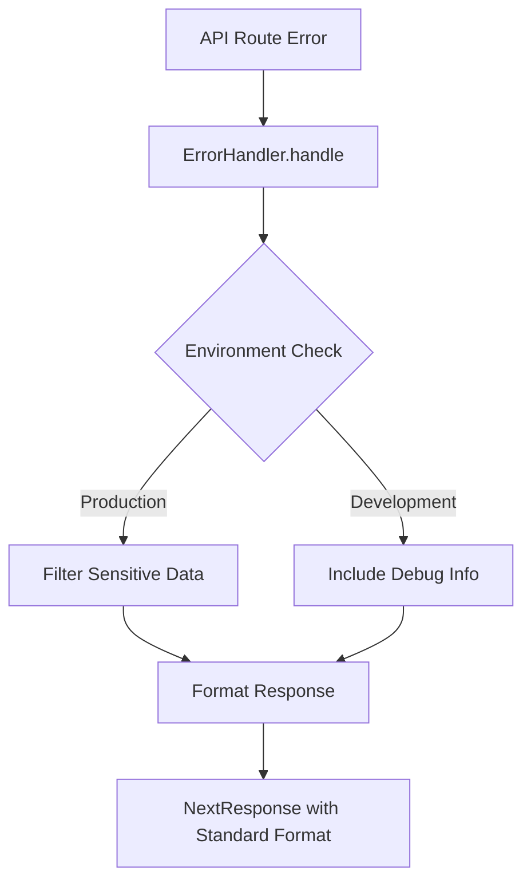

# Design Document: Error Response Standardization

## Overview

This design implements a centralized error handling system for the Next.js API routes to ensure consistent error response formats across all endpoints. The solution provides a standardized error response structure while maintaining security by filtering sensitive information in production environments.

The design introduces a utility-based approach that can be gradually adopted across existing API routes without breaking changes. The error handler automatically detects the runtime environment and applies appropriate security filtering while maintaining a consistent response format for API consumers.

## Architecture

### Core Components

The error standardization system consists of three main components:

1. **ErrorHandler Utility** (`src/lib/error-handler.ts`)
   - Central error formatting logic
   - Environment-aware security filtering
   - NextResponse generation

2. **Error Types** (`src/lib/error-types.ts`)
   - TypeScript interfaces for error structures
   - Validation helpers
   - Error classification utilities

3. **Integration Layer**
   - Wrapper functions for common error scenarios
   - Migration helpers for existing routes
   - Consistent HTTP status code mapping

### Error Response Flow



### Environment-Based Filtering

The system applies different levels of information exposure based on the runtime environment:

- **Production**: Minimal error information, no stack traces, generic messages for server errors
- **Development**: Full error details, stack traces, debugging information

## Components and Interfaces

### ErrorHandler Class

The central error handling utility provides methods for different error scenarios:

```typescript
class ErrorHandler {
  static handle(error: unknown, statusCode?: number): NextResponse
  static validation(message: string, field?: string): NextResponse
  static notFound(resource?: string): NextResponse
  static unauthorized(message?: string): NextResponse
  static serverError(error?: unknown): NextResponse
}
```

### Standard Error Response Interface

All error responses follow this consistent structure:

```typescript
interface StandardErrorResponse {
  error: string;           // Machine-readable error code or short message
  message?: string;        // Human-readable description (optional)
  details?: unknown;       // Additional context (development only)
}
```

### Error Classification

Errors are classified into categories for consistent handling:

```typescript
enum ErrorType {
  VALIDATION = 'validation_error',
  NOT_FOUND = 'not_found',
  UNAUTHORIZED = 'unauthorized',
  FORBIDDEN = 'forbidden',
  SERVER_ERROR = 'server_error',
  EXTERNAL_SERVICE = 'external_service_error'
}
```

## Data Models

### Error Context

Internal error context structure for processing:

```typescript
interface ErrorContext {
  originalError: unknown;
  statusCode: number;
  errorType: ErrorType;
  message?: string;
  details?: Record<string, unknown>;
  stack?: string;
}
```

### Environment Configuration

Environment detection and configuration:

```typescript
interface EnvironmentConfig {
  isProduction: boolean;
  includeStackTrace: boolean;
  includeDetails: boolean;
  logLevel: 'error' | 'warn' | 'info' | 'debug';
}
```

## Correctness Properties

*A property is a characteristic or behavior that should hold true across all valid executions of a system-essentially, a formal statement about what the system should do. Properties serve as the bridge between human-readable specifications and machine-verifiable correctness guarantees.*
### Property Reflection

After analyzing all acceptance criteria, several properties can be consolidated to eliminate redundancy:

- Properties 1.3 and 2.2 both address the details field in different environments - these can be combined into a single environment-aware property
- Properties 1.1 and 6.1 both ensure the error field is always present - 6.1 is redundant
- Properties 3.1 is covered by the combination of properties 1.1-1.4 - it's redundant
- Properties 5.1 and 5.2 are architectural constraints rather than testable behaviors

The remaining properties provide unique validation value and will be implemented as separate property-based tests.

### Property 1: Standard Error Response Structure

*For any* error input provided to the ErrorHandler, the generated response should always contain an "error" field with a non-empty string value.

**Validates: Requirements 1.1, 6.1**

### Property 2: Conditional Message Field

*For any* error input that contains a human-readable description, the ErrorHandler should include a "message" field with that description, and when present, the message field should contain a non-empty string.

**Validates: Requirements 1.2, 6.2**

### Property 3: Environment-Aware Details Field

*For any* error input, when in development environment the ErrorHandler should include a "details" field with additional context, and when in production environment the "details" field should be excluded.

**Validates: Requirements 1.3, 2.2**

### Property 4: Field Name Consistency

*For any* error response generated by the ErrorHandler, only the field names "error", "message", and "details" should be used in the response object.

**Validates: Requirements 1.4**

### Property 5: Production Stack Trace Filtering

*For any* error input containing stack trace information, when in production environment the ErrorHandler should exclude all stack trace data from the response.

**Validates: Requirements 2.1**

### Property 6: Development Stack Trace Inclusion

*For any* error input containing stack trace information, when in development environment the ErrorHandler should include the stack trace in the "details" field.

**Validates: Requirements 2.3**

### Property 7: Sensitive Data Filtering

*For any* error input containing internal file paths, database connection strings, or API keys, the ErrorHandler should filter out this sensitive information from all response fields in any environment.

**Validates: Requirements 2.4**

### Property 8: HTTP Status Code Preservation

*For any* error input with an associated error type, the ErrorHandler should return the appropriate HTTP status code for that error type.

**Validates: Requirements 3.2**

### Property 9: Validation Error Status

*For any* validation error input, the ErrorHandler should return HTTP status code 400.

**Validates: Requirements 3.3**

### Property 10: Server Error Production Handling

*For any* server error input, when in production environment the ErrorHandler should return HTTP status code 500 with a generic error message.

**Validates: Requirements 3.4**

### Property 11: NextResponse Return Type

*For any* error input provided to the ErrorHandler utility function, it should return a valid NextResponse object.

**Validates: Requirements 4.1**

### Property 12: Automatic Environment Detection

*For any* error input, the ErrorHandler should automatically detect the current environment and apply appropriate filtering without requiring explicit environment parameters.

**Validates: Requirements 4.2**

### Property 13: Custom Error Code Support

*For any* custom error code and message provided to the ErrorHandler, the response should maintain the standard format while including the custom values.

**Validates: Requirements 4.3**

### Property 14: Input Type Flexibility

*For any* input that is either an Error object or a plain string, the ErrorHandler should process it correctly and generate a valid response.

**Validates: Requirements 4.4**

### Property 15: Malformed Input Handling

*For any* malformed or incomplete error input, the ErrorHandler should gracefully handle the input without throwing exceptions and produce a valid error response.

**Validates: Requirements 5.3**

### Property 16: Default Value Provision

*For any* error input missing required fields, the ErrorHandler should provide sensible default values while maintaining the standard response structure.

**Validates: Requirements 5.4**

### Property 17: Details Field Serializability

*For any* error response that includes a "details" field, the details value should be JSON serializable.

**Validates: Requirements 6.3**

### Property 18: JSON Parsing Validity

*For any* error response generated by the ErrorHandler, parsing the JSON should produce a valid object containing at minimum the "error" property.

**Validates: Requirements 6.4**

## Error Handling

The error handling system itself must be robust and handle edge cases gracefully:

### Input Validation
- Null or undefined error inputs default to generic server error
- Circular reference objects are safely serialized
- Non-serializable values are converted to string representations

### Environment Detection
- Falls back to development mode if NODE_ENV is undefined
- Handles missing or malformed environment variables
- Provides consistent behavior across different deployment environments

### Security Measures
- Regex-based filtering for sensitive patterns
- Whitelist approach for allowed error information in production
- Sanitization of error messages to prevent information leakage

### Logging Integration
- Structured logging for error tracking
- Correlation IDs for request tracing
- Different log levels based on error severity

## Testing Strategy

The testing approach combines unit tests for specific scenarios with property-based tests for comprehensive coverage:

### Unit Testing Focus
- Specific error scenarios (validation, not found, unauthorized)
- Environment configuration edge cases
- Integration with existing API routes
- Security filtering for known sensitive patterns

### Property-Based Testing Configuration
- **Library**: fast-check for TypeScript/JavaScript property-based testing
- **Iterations**: Minimum 100 iterations per property test
- **Test Tags**: Each property test references its design document property
- **Coverage**: All 18 correctness properties implemented as property tests

### Property Test Examples

```typescript
// Example property test structure
describe('ErrorHandler Properties', () => {
  it('Property 1: Standard Error Response Structure', () => {
    fc.assert(fc.property(
      fc.oneof(fc.string(), fc.record({}), fc.constantFrom(new Error())),
      (errorInput) => {
        const response = ErrorHandler.handle(errorInput);
        const body = JSON.parse(response.body);
        expect(body).toHaveProperty('error');
        expect(typeof body.error).toBe('string');
        expect(body.error.length).toBeGreaterThan(0);
      }
    ), { numRuns: 100 });
  });
});
```

### Integration Testing
- Test migration of existing API routes
- Verify backward compatibility with current error formats
- End-to-end testing of error scenarios across different environments

The dual testing approach ensures both specific edge cases are covered through unit tests while property-based tests verify the universal correctness properties across all possible inputs.