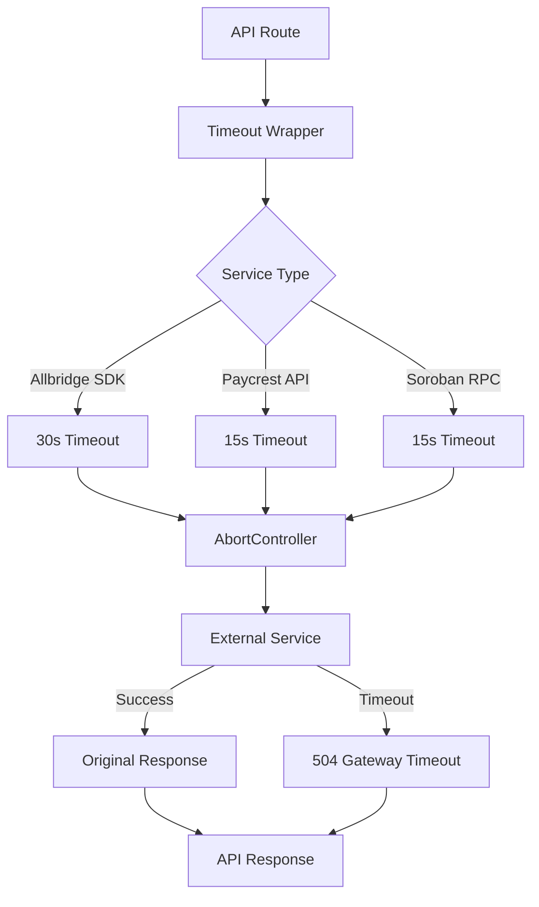

# Design Document: External Service Timeouts

## Overview

This design implements comprehensive timeout protection for all external service calls in the API routes to prevent indefinite hanging and improve system reliability. The solution wraps Allbridge SDK operations, Paycrest API calls, and Soroban RPC requests with proper timeout mechanisms using AbortController and returns consistent 504 Gateway Timeout responses when timeouts occur.

The implementation provides service-specific timeout durations (30s for Allbridge SDK, 15s for Paycrest API and Soroban RPC) while preserving existing functionality and error handling patterns. All timeout events are logged for monitoring and debugging purposes.

## Architecture

### Core Components



### Service Integration Points

The timeout wrapper integrates at the following points in the existing codebase:

1. **Allbridge SDK Operations**
   - SDK initialization and chain details fetching
   - Quote calculations (`getAmountToBeReceived`)
   - Transaction building (`buildSwapAndBridgeTx`)
   - Gas fee options retrieval

2. **Paycrest API Calls**
   - Order creation and status retrieval
   - Currency and institution fetching
   - Account verification
   - Rate quotes

3. **Soroban RPC Requests**
   - Transaction submission (`sendTransaction`)
   - Transaction status polling (`getTransaction`)
   - Direct RPC method calls

## Components and Interfaces

### TimeoutWrapper Interface

```typescript
interface TimeoutConfig {
  duration: number;
  serviceName: string;
  operation?: string;
}

interface TimeoutResult<T> {
  success: boolean;
  data?: T;
  error?: TimeoutError;
  duration: number;
}

class TimeoutError extends Error {
  constructor(
    public serviceName: string,
    public duration: number,
    public operation?: string
  ) {
    super(`${serviceName} timeout after ${duration / 1000}s${operation ? ` (${operation})` : ''}`);
    this.name = 'TimeoutError';
  }
}
```

### Service-Specific Wrappers

```typescript
// Allbridge SDK wrapper
export function withAllbridgeTimeout<T>(
  promise: Promise<T>,
  operation?: string
): Promise<T>;

// Paycrest API wrapper  
export function withPaycrestTimeout<T>(
  promise: Promise<T>,
  operation?: string
): Promise<T>;

// Soroban RPC wrapper
export function withSorobanTimeout<T>(
  promise: Promise<T>,
  operation?: string
): Promise<T>;
```

### Enhanced AbortController Integration

```typescript
interface AbortablePromise<T> extends Promise<T> {
  abort(): void;
}

function createAbortablePromise<T>(
  executor: (signal: AbortSignal) => Promise<T>,
  timeoutMs: number
): AbortablePromise<T>;
```

## Data Models

### Timeout Configuration

```typescript
export const TIMEOUT_CONFIG = {
  ALLBRIDGE_SDK: {
    duration: 30000, // 30 seconds
    serviceName: 'Bridge service'
  },
  PAYCREST_API: {
    duration: 15000, // 15 seconds  
    serviceName: 'Payment service'
  },
  SOROBAN_RPC: {
    duration: 15000, // 15 seconds
    serviceName: 'Blockchain service'
  }
} as const;
```

### Error Response Format

```typescript
interface TimeoutErrorResponse {
  error: string;
  message: string;
  service: string;
  duration: number;
  timestamp: string;
}
```

### Logging Data Model

```typescript
interface TimeoutLogEntry {
  timestamp: string;
  service: string;
  operation?: string;
  duration: number;
  status: 'success' | 'timeout' | 'near_timeout';
  requestId?: string;
  error?: string;
}
```
## Correctness Properties

*A property is a characteristic or behavior that should hold true across all valid executions of a system-essentially, a formal statement about what the system should do. Properties serve as the bridge between human-readable specifications and machine-verifiable correctness guarantees.*

After analyzing the acceptance criteria, several properties can be consolidated to eliminate redundancy:

**Property Reflection:**
- Properties 1.1, 2.1, 3.1 (service-specific timeout durations) can be combined with 6.1-6.3 into comprehensive timeout configuration properties
- Properties 1.2, 2.2, 3.2 (AbortController cancellation) can be combined with 5.2 into a single cancellation property
- Properties 1.3, 2.3, 3.3 (service-specific error messages) can be combined with 4.1-4.2 into unified error response properties
- Properties 1.4, 2.4, 3.4, 7.1-7.3 (preserving existing behavior) can be combined into comprehensive backward compatibility properties

### Property 1: Service-Specific Timeout Durations

*For any* external service call, the timeout wrapper should apply the correct timeout duration: 30 seconds for Allbridge SDK operations, 15 seconds for Paycrest API calls, and 15 seconds for Soroban RPC calls.

**Validates: Requirements 1.1, 2.1, 3.1, 6.1, 6.2, 6.3, 6.4**

### Property 2: Timeout Cancellation with AbortController

*For any* external service call that exceeds its timeout duration, the timeout wrapper should call abort() on the AbortController and clean up timeout handlers properly.

**Validates: Requirements 1.2, 2.2, 3.2, 5.1, 5.2, 5.4**

### Property 3: Consistent Timeout Error Responses

*For any* external service timeout, the API route should return HTTP status 504 with a descriptive error message identifying the specific service that timed out, using the standardized error response format.

**Validates: Requirements 1.3, 2.3, 3.3, 4.1, 4.2, 4.3**

### Property 4: Backward Compatibility Preservation

*For any* external service call that completes within the timeout period, the timeout wrapper should preserve the original response format and existing error handling logic without modification.

**Validates: Requirements 1.4, 2.4, 3.4, 7.1, 7.2, 7.3, 7.4**

### Property 5: AbortSignal Integration

*For any* external service call that supports AbortSignal, the timeout wrapper should pass the AbortSignal to enable proper request cancellation.

**Validates: Requirements 5.3**

### Property 6: Comprehensive Timeout Logging

*For any* timeout event, the timeout wrapper should log structured data including service name, operation, timeout duration, and request context for monitoring purposes.

**Validates: Requirements 4.4, 8.1, 8.2, 8.4**

### Property 7: Near-Timeout Warning Logs

*For any* external service call that completes successfully but takes more than 80% of the timeout duration, the timeout wrapper should log a warning for monitoring slow operations.

**Validates: Requirements 8.3**

## Error Handling

### Timeout Error Classification

The system distinguishes between different types of errors:

1. **Timeout Errors**: Operations that exceed their configured timeout duration
2. **Service Errors**: Errors returned by external services (preserved as-is)
3. **Network Errors**: Connection failures and network-related issues
4. **Validation Errors**: Invalid input parameters (handled before timeout wrapper)

### Error Response Mapping

```typescript
// Timeout errors -> 504 Gateway Timeout
{
  error: "Gateway timeout",
  message: "{serviceName} timeout after {duration}s",
  service: "{serviceName}",
  duration: number,
  timestamp: string
}

// Service errors -> Original status code preserved
{
  error: "Service error", 
  message: "{original error message}",
  // ... original error fields preserved
}
```

### Fallback Mechanisms

- **Graceful Degradation**: API routes continue to function with timeout protection
- **Error Logging**: All timeout events are logged for monitoring and debugging
- **Resource Cleanup**: AbortControllers and timeout handlers are properly cleaned up
- **Retry Guidance**: Error responses include information about whether retries are appropriate

## Testing Strategy

### Dual Testing Approach

The testing strategy combines unit tests for specific scenarios with property-based tests for comprehensive coverage:

**Unit Tests** focus on:
- Specific timeout scenarios with known durations
- Error response format validation
- AbortController integration points
- Resource cleanup verification
- Integration with existing API routes

**Property-Based Tests** focus on:
- Universal timeout behavior across all service types
- Comprehensive input coverage through randomization
- Backward compatibility preservation
- Logging consistency across different scenarios

### Property-Based Testing Configuration

- **Library**: fast-check for TypeScript/JavaScript property-based testing
- **Iterations**: Minimum 100 iterations per property test
- **Test Tags**: Each property test references its design document property

**Tag Format**: `Feature: external-service-timeouts, Property {number}: {property_text}`

### Test Implementation Requirements

Each correctness property must be implemented by a single property-based test:

1. **Property 1 Test**: Generate random service types and verify correct timeout durations
2. **Property 2 Test**: Generate long-running operations and verify AbortController cancellation
3. **Property 3 Test**: Generate timeout scenarios and verify 504 error response format
4. **Property 4 Test**: Generate successful operations and verify response preservation
5. **Property 5 Test**: Generate AbortSignal-compatible operations and verify signal passing
6. **Property 6 Test**: Generate timeout events and verify log structure and content
7. **Property 7 Test**: Generate near-timeout operations and verify warning logs

### Unit Test Coverage

Unit tests complement property tests by covering:
- Specific API route integration points
- Edge cases like network failures during timeout
- Interaction with existing error handling middleware
- Performance impact measurement
- Mock service behavior validation