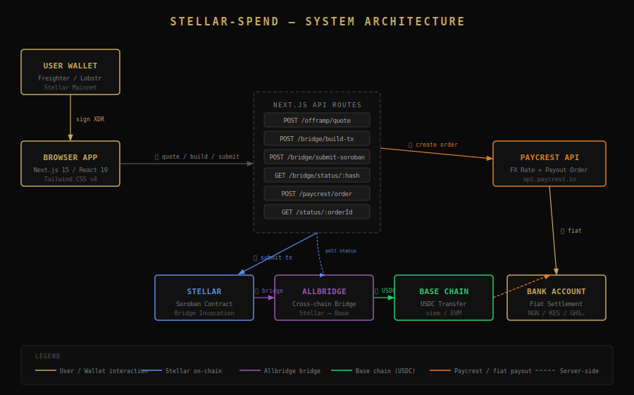
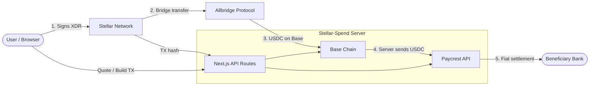
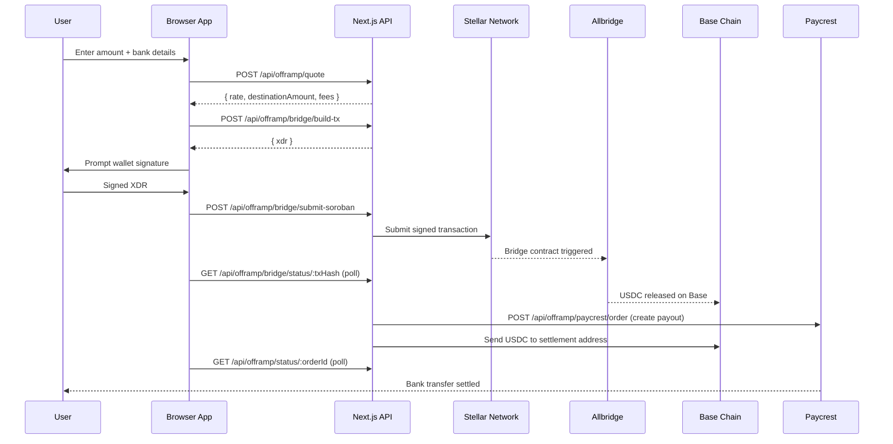

# Stellar-Spend

[](https://github.com/whiteghost0001/Stellar-Spend/actions)
[](./LICENSE)
[](https://nextjs.org)
[](https://www.typescriptlang.org)

> **Convert Stellar stablecoins (USDC / USDT) to fiat currencies and receive funds directly in your bank account — non-custodial, real-time, global.**

---

## Table of Contents

- [Overview](#overview)
- [Architecture](#architecture)
- [Offramp Flow](#offramp-flow)
- [Tech Stack](#tech-stack)
- [Setup Guide](#setup-guide)
- [Environment Variables](#environment-variables)
- [API Reference](#api-reference)
- [Troubleshooting](#troubleshooting)
- [Contributing](#contributing)
- [Contact](#contact)
- [License](#license)

---

## Overview

Stellar-Spend is a production-grade off-ramp application that lets users convert Stellar-based stablecoins to local fiat currencies (NGN, KES, GHS, etc.) with direct bank transfers. It bridges Stellar → Base via Allbridge, then routes the Base USDC to a Paycrest payout order that settles to the beneficiary's bank account.

## Architecture



> Full-resolution SVG: [`public/architecture.svg`](./public/architecture.svg)

The diagram shows the complete data flow:

1. **User** signs a Soroban XDR in their Stellar wallet (Freighter / Lobstr)
2. **Next.js API** builds the bridge transaction and submits it to Stellar
3. **Allbridge** detects the Stellar deposit and releases USDC on Base
4. **Server** creates a Paycrest payout order and sends Base USDC to the settlement address
5. **Paycrest** converts USDC → fiat and initiates the bank transfer
6. **Beneficiary** receives local currency (NGN, KES, GHS, …)


## Key Features

- Connect Freighter or Lobstr wallet (auto-detect)
- Real-time FX rate display (live USDC/NGN ticker)
- Dual input mode: enter crypto amount or fiat amount
- Automatic fee calculation (XLM or USDC gas fee)
- Non-custodial: the server never holds user funds
- Transaction history stored in browser `localStorage`
- PWA-installable on mobile

---

## Architecture



**Data flow summary:**

| Step | Actor | Action |
|------|-------|--------|
| 1 | Browser | Fetches quote, builds Soroban XDR, user signs in wallet |
| 2 | Stellar | Signed transaction submitted; Allbridge bridge contract invoked |
| 3 | Allbridge | Detects Stellar deposit, releases USDC on Base |
| 4 | Server | Polls bridge status; sends Base USDC to Paycrest settlement address |
| 5 | Paycrest | Converts USDC → fiat, initiates bank transfer |
| 6 | Bank | Beneficiary receives local currency |

---

## Offramp Flow



---

## Tech Stack

| Technology | Version | Purpose |
|---|---|---|
| [Next.js](https://nextjs.org) | 15.5 | App framework (App Router, API routes) |
| [React](https://react.dev) | 19.0 | UI library |
| [TypeScript](https://www.typescriptlang.org) | 5.7 | Type safety |
| [Tailwind CSS](https://tailwindcss.com) | 4.2 | Styling |
| [@stellar/stellar-sdk](https://github.com/stellar/js-stellar-sdk) | 14.6 | Stellar / Soroban transaction building |
| [@stellar/freighter-api](https://github.com/stellar/freighter) | 6.0 | Freighter wallet integration |
| [@allbridge/bridge-core-sdk](https://github.com/allbridge-io/allbridge-core-sdk) | 3.29 | Stellar → Base bridge |
| [viem](https://viem.sh) | 2.47 | Base chain interaction |
| [Paycrest API](https://paycrest.io) | v1 | Fiat payout / bank settlement |
| [Sentry](https://sentry.io) | 10.46 | Error monitoring |
| [Vitest](https://vitest.dev) | 4.1 | Unit testing |
| [Playwright](https://playwright.dev) | 1.58 | E2E testing |

---

## Setup Guide

### Prerequisites

- Node.js ≥ 20
- A [Paycrest](https://paycrest.io) account (API key + webhook secret)
- A Base wallet private key (for the server-side payout wallet)
- A Base RPC URL (e.g. from [Alchemy](https://alchemy.com) or [Infura](https://infura.io))

### 1. Clone

```bash
git clone https://github.com/whiteghost0001/Stellar-Spend.git
cd Stellar-Spend
```

### 2. Install dependencies

```bash
npm install
```

### 3. Configure environment

```bash
cp .env.example .env.local
```

Then fill in `.env.local` — see [Environment Variables](#environment-variables) below.

### 4. Run development server

```bash
npm run dev
```

Open [http://localhost:3001](http://localhost:3001).

### 5. Run tests

```bash
npm test          # unit tests (vitest)
npm run test:e2e  # end-to-end tests (playwright, requires running server)
```

### 6. Build for production

```bash
npm run build
npm start
```

### 7. Bundle analysis

```bash
npm run build:analyze
```

---

## Environment Variables

All variables are documented in [`.env.example`](./.env.example). The table below summarises each one.

| Variable | Required | Exposed to browser | Description |
|---|---|---|---|
| `PAYCREST_API_KEY` | ✅ | ❌ | Paycrest dashboard API key |
| `PAYCREST_WEBHOOK_SECRET` | ✅ | ❌ | Paycrest webhook HMAC signing secret |
| `BASE_PRIVATE_KEY` | ✅ | ❌ | Private key of the Base payout wallet (hex, `0x…`) |
| `BASE_RETURN_ADDRESS` | ✅ | ❌ | Base address for returns / treasury routing |
| `BASE_RPC_URL` | ✅ | ❌ | Base chain RPC provider URL |
| `STELLAR_SOROBAN_RPC_URL` | ✅ | ❌ | Soroban RPC endpoint (server-side) |
| `STELLAR_HORIZON_URL` | ✅ | ❌ | Horizon endpoint (server-side) |
| `NEXT_PUBLIC_STELLAR_SOROBAN_RPC_URL` | ✅ | ✅ | Soroban RPC endpoint (browser-safe) |
| `NEXT_PUBLIC_BASE_RETURN_ADDRESS` | ✅ | ✅ | Base return address (browser-safe) |
| `NEXT_PUBLIC_STELLAR_USDC_ISSUER` | ✅ | ✅ | Stellar USDC issuer account (for trustline filtering) |

> ⚠️ **Never** prefix secrets with `NEXT_PUBLIC_`. The app validates this at startup and throws if a secret is accidentally exposed.

---

## API Reference

### Offramp

| Method | Path | Description |
|--------|------|-------------|
| `POST` | `/api/offramp/quote` | Get a conversion quote with FX rate and fees |
| `GET` | `/api/offramp/currencies` | List supported fiat currencies |
| `GET` | `/api/offramp/institutions/[currency]` | List banks / institutions for a currency |
| `POST` | `/api/offramp/verify-account` | Verify a beneficiary account number |
| `GET` | `/api/offramp/rate` | Get live USDC/NGN spot rate |

### Bridge

| Method | Path | Description |
|--------|------|-------------|
| `POST` | `/api/offramp/bridge/build-tx` | Build Soroban XDR for the bridge transfer |
| `POST` | `/api/offramp/bridge/submit-soroban` | Submit a signed Soroban XDR |
| `GET` | `/api/offramp/bridge/status/[txHash]` | Poll Allbridge transfer status |
| `GET` | `/api/offramp/bridge/tx-status/[hash]` | Poll Stellar on-chain transaction status |
| `GET` | `/api/offramp/bridge/gas-fee-options` | Get available gas fee options (XLM / USDC) |

### Payout

| Method | Path | Description |
|--------|------|-------------|
| `POST` | `/api/offramp/paycrest/order` | Create a Paycrest payout order |
| `GET` | `/api/offramp/status/[orderId]` | Poll payout order status |
| `POST` | `/api/offramp/execute-payout` | Trigger Base USDC transfer to Paycrest |

### Webhooks & Health

| Method | Path | Description |
|--------|------|-------------|
| `POST` | `/api/webhooks/paycrest` | Receive Paycrest webhook events (HMAC-verified) |
| `GET` | `/api/health` | Health check endpoint |

---

### Example: Get Quote

**Request**
```http
POST /api/offramp/quote
Content-Type: application/json

{
  "amount": "100",
  "currency": "NGN",
  "feeMethod": "USDC"
}
```

**Response**
```json
{
  "destinationAmount": "158202.00",
  "rate": 1598,
  "currency": "NGN",
  "bridgeFee": "0.5",
  "payoutFee": "0",
  "estimatedTime": 300
}
```

---

### Example: Build Bridge Transaction

**Request**
```http
POST /api/offramp/bridge/build-tx
Content-Type: application/json

{
  "amount": "99.5",
  "fromAddress": "GCFX...ABCD",
  "toAddress": "0xd8dA...6045",
  "feePaymentMethod": "stablecoin"
}
```

**Response**
```json
{
  "xdr": "AAAAAgAAAAB...",
  "sourceToken": { "symbol": "USDC", "decimals": 7, "chain": "STELLAR" },
  "destinationToken": { "symbol": "USDC", "decimals": 6, "chain": "BASE" }
}
```

---

## Troubleshooting

### `Error: Invalid environment configuration`

One or more required env vars are missing. Copy `.env.example` to `.env.local` and fill in all values.

### `Freighter extension is not installed`

Install the [Freighter](https://freighter.app) browser extension, or use [Lobstr](https://lobstr.co) as a fallback.

### `Freighter is set to Testnet. Please switch to Mainnet.`

Open Freighter → Settings → Network → select **Mainnet (Public)**.

### `Insufficient XLM balance for native gas fee`

Your Stellar account's XLM balance would fall below the minimum reserve after paying the gas fee. Either add more XLM or switch to **USDC fee** payment.

### `Bridge quote unavailable` (502)

The Allbridge SDK could not fetch chain details. This is usually a transient network issue — retry after a few seconds.

### `FX rate unavailable` (502)

The Paycrest rate API is unreachable. Check [Paycrest status](https://paycrest.io) and retry.

### `Simulation failed: resulting balance is not within the allowed range`

Your USDC balance is insufficient to cover the transfer amount plus fees.

### Bundle size CI failure

The CI build fails if `.next/` exceeds **150 MB**. Run `npm run build:analyze` to identify large chunks and consider dynamic imports.

---

## Contributing

Please read [CONTRIBUTING.md](./CONTRIBUTING.md) for branch naming conventions, commit message format, and the pull request process.

---

## Contact

Questions or feedback? Reach out on Telegram: [t.me/Xoulomon](https://t.me/Xoulomon)

---

## License

[MIT](./LICENSE) © Stellar-Spend Contributors
